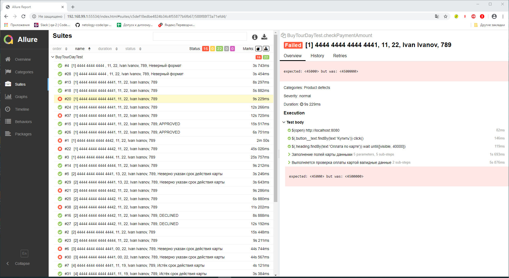

### Отчёт о проведённом тестировании

Была выполнена автоматизация тестирования приложения по продаже тура "Выходного дня", представляещего из себя веб-сервис, взаимодействующий с СУБД и API Банка.

#### Количество тест-кейсов

Было сделано и выполнено 38 тест-кейсов.
Автотесты были написаны в соотвествии с автосценариями из файла [Plan.md](https://github.com/anmak70/aqa-diplom/blob/master/Plan.md)

• Перечень автоматизируемых сценариев:
1. Проверка выбора покупки тура по карте или в кредит с главной страницы:
1.1 Проверка выбора покупки тура по дебетовой карте
1.2 Проверка выбора покупки тура в кредит по данным дебетовой карты
2. Проверка покупки тура по дебетовой карте:
2.1 Проверка покупки тура по дебетовой карте с валидным заполнением всех полей
2.2 Проверка покупки тура по дебетовой карте с валидным заполнением всех полей кроме поля "номер карты"
2.3 Проверка покупки тура по дебетовой карте с валидным заполнением всех полей кроме поля "месяц - 13"
2.4 Проверка покупки тура по дебетовой карте с валидным заполнением всех полей кроме поля "месяц - 00"
2.5 Проверка покупки тура по дебетовой карте с валидным заполнением всех полей кроме поля "год"
2.6 Проверка покупки тура по дебетовой карте с валидным заполнением всех полей кроме поля "Владелец - цифрами"
2.7 Проверка покупки тура по дебетовой карте с валидным заполнением всех полей кроме поля "Владелец - Спец.символы"
2.8 Проверка покупки тура по дебетовой карте с валидным заполнением всех полей кроме поля "Владелец - русский алфавит"
2.9 Проверка покупки тура по дебетовой карте с валидным заполнением всех полей кроме поля "CVC"
2.10 Проверка покупки тура по дебетовой карте с незаполнеными полями
2.11 Проверка покупки тура по дебетовой карте с валидным заполнением всех полей, "номер карты" со статусом DECLINED
2.12 Проверка покупки тура по дебетовой карте с валидным заполнением всех полей, "номер карты" не из списка
3. Проверка покупки тура в кредит по данным дебетовой карты:
3.1 Проверка покупки тура в кредит с валидным заполнением всех полей
3.2 Проверка покупки тура в кредит с валидным заполнением всех полей кроме поля "номер карты"
3.3 Проверка покупки тура в кредит с валидным заполнением всех полей кроме поля "месяц - 13"
3.4 Проверка покупки тура в кредит с валидным заполнением всех полей кроме поля "месяц - 00"
3.5 Проверка покупки тура в кредит с валидным заполнением всех полей кроме поля "год"
3.6 Проверка покупки тура в кредит с валидным заполнением всех полей кроме поля "Владелец - цифрами"
3.7 Проверка покупки тура в кредит с валидным заполнением всех полей кроме поля "Владелец - Спец.символы"
3.8 Проверка покупки тура в кредит с валидным заполнением всех полей кроме поля "Владелец - русский алфавит"
3.9 Проверка покупки тура в кредит с валидным заполнением всех полей кроме поля "CVC"
3.10 Проверка покупки тура в кредит с незаполнеными полями
3.11 Проверка покупки тура в кредит с валидным заполнением всех полей, "номер карты" со статусом DECLINED
3.12 Проверка покупки тура в кредит с валидным заполнением всех полей, "номер карты" не из списка
4. Проверка корректности работы с базой данных и внесением данных:
4.1 Проверка поля "amount" таблицы 'payment_entry" при покупке тура по дебетовой карте с валидным заполнением всех полей статус карты APPROVED
4.2 Проверка поля "status" таблицы 'payment_entry" при покупке тура по дебетовой карте с валидным заполнением всех полей статус карты APPROVED
4.3 Проверка равенства "transaction_id" из таблицы 'payment_entry" с "payment_id" таблицы "order_entry" при покупке тура по дебетовой карте с валидным заполнением всех полей, статус карты APPROVED
4.4 Проверка поля "status" таблицы 'payment_entry" при покупке тура по дебетовой карте с валидным заполнением всех полей статус карты DECLINED
4.5 Проверка поля "amount" таблицы 'payment_entry" при покупке тура по дебетовой карте с валидным заполнением всех полей статус карты DECLINED
4.6 Проверка равенства "transaction_id" из таблицы 'payment_entry" с "payment_id" таблицы "order_entry" при покупке тура по дебетовой карте с валидным заполнением всех полей, статус карты DECLINED
4.7 Проверка поля "status" таблицы 'credit_request_entry" при покупке тура в кредит с валидным заполнением всех полей статус карты APPROVED
4.8 Проверка равенства "bank_id" из таблицы "credit_request_entry" с "credit_id" таблицы "order_entry" при покупке тура в кредит с валидным заполнением всех полей, статус карты APPROVED
4.9 Проверка поля "status" таблицы 'credit_request_entry" при покупке тура в кредит с валидным заполнением всех полей статус карты DECLINED
4.10 Проверка равенства "bank_id" из таблицы "credit_request_entry" с "credit_id" таблицы "order_entry" при покупке тура в кредит с валидным заполнением всех полей, статус карты DECLINED
4.11 Проверка появления новых записей в таблицах 'payment_entry", "credit_request_entity", "order_entry" при покупке тура по дебетовой карте с валидным заполнением всех полей, карта не валидная
4.12 Проверка появления новых записей в таблицах 'payment_entry", "credit_request_entity", "order_entry" при покупке тура в кредит с валидным заполнением всех полей, карта не валидная

#### % успешных/не успешных

Из 38 тест-кейсов 22 было успешных, 16 не успешных. Процент успешных тест-кейсов = 57,89%
Issues по результатам упавших авто-тестов № #5 - #20

#### Общие рекомендации

Необходимо выполнить исправления в работе приложения по итогам выполнения автотестов. В данный момент корректная работа приложения не возможна. В SUT интегрирована возможность получить отчеты с помощью Allure. Так же можно получить стандартные отчеты  Gradle.

